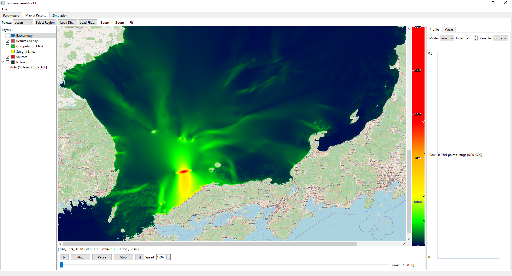

# tsunami-ui

Qt6 desktop app for the **NskTSH** tsunami stack: load bathymetry grids, view
results, inspect coastal wave histograms / profiles over a map, and (optionally)
launch simulations. **Works standalone as a results viewer** — no simulator
required to open and analyze results.

## Screenshots


More in [`docs/`](docs/): bathymetry view, closer result, parameters, and the simulation tab.

## Place in the NskTSH ecosystem
- Depends on [`tsunami-core`](https://github.com/NskTSH/tsunami-core) — header-only
  I/O foundation (parsers/formats/params/coord/sources). **Sibling repo** by workspace convention.
- Optionally runs `tsunami-simulator` (private) — the SWE solver,
  launched as an external `.exe` (discovered lazily; not required to start the UI).
- Data / results: workspace convention — see
  [`tsunami-data/WORKSPACE.md`](https://github.com/NskTSH/tsunami-data/blob/master/WORKSPACE.md).

## Requirements
- C++20 compiler (MSVC 2022 or recent Clang/GCC), CMake ≥ 3.20, Qt6 (Widgets, Network, Concurrent).
- `tsunami-core` cloned **as a sibling** (next to this repo).

## Build
```bash
# clone tsunami-core next to tsunami-ui (workspace convention), then:
cmake -B build -DCMAKE_PREFIX_PATH=<path-to-Qt6>
cmake --build build --config Release
```
Override the core location with `-DTSUNAMI_CORE_DIR=<path-to-tsunami-core>` if it is not a sibling.

## Dependency on tsunami-core
The UI consumes the header-only target `NskTSH::tsunami-io` from `tsunami-core` (parsers/formats:
`ASCParser`, `ZDataParser`, `DefaultParametersParser`, `EllipsoidalSource`, `CoordSystem`).
CMake links it via `add_subdirectory(${TSUNAMI_CORE_DIR})`. No DLL — header-only source dependency.

## Running simulations (optional)
The UI never requires a simulator to start. The Run tab auto-discovers
`tsunami-simulator` in this order: saved setting → app-local `simulator/` →
`$TSUNAMI_SIMULATOR_HOME` → sibling `tsunami-simulator` build → `PATH`. If none is
found, the **Launch** button stays disabled and viewing keeps working; you can also
point to a simulator via **Browse…**.

## Data & results
Paths resolve from `NSKTSH_DATA` / `NSKTSH_RESULTS` (default `../Data`, `../Results`). No absolute paths in code.

## License
Apache-2.0 © NskTSH — see [`LICENSE`](LICENSE) and `NOTICE`.
